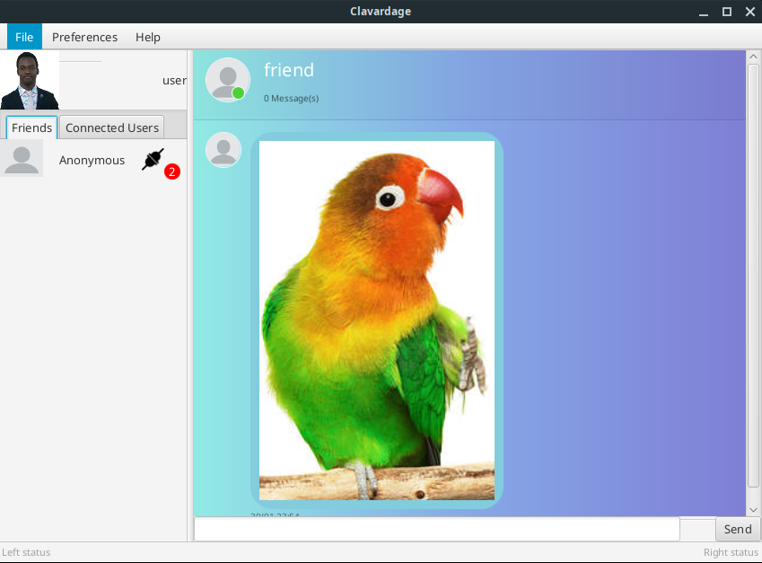

# Clavardage
 



## Have tree modes:

+ A Test mode:  To open multiple clients on same machine, for testing purpose
+ Broadcast mode for local networks
+ A centralized mode with a Server on ip address http://node6669-clavadage.jcloud.ik-server.com/webapi/

## Requirements
+ Java Runtime Environment 8 is recommended. It should works on higher versions but not tested.
Please report any issue.


##Usage

+ Execute chat.jar 
+ or from console run `java -jar chat.jar`

NB: The Jar file must be in the root directory of the project because it use resources located in 
```
.
+-- diagrams
+-- libs
+-- src
|   +-- main
|       ..
|       +-- resources
+-- chat.jar
``` 
## Development Requirements

+ JDK >= 1.8
+ Maven
